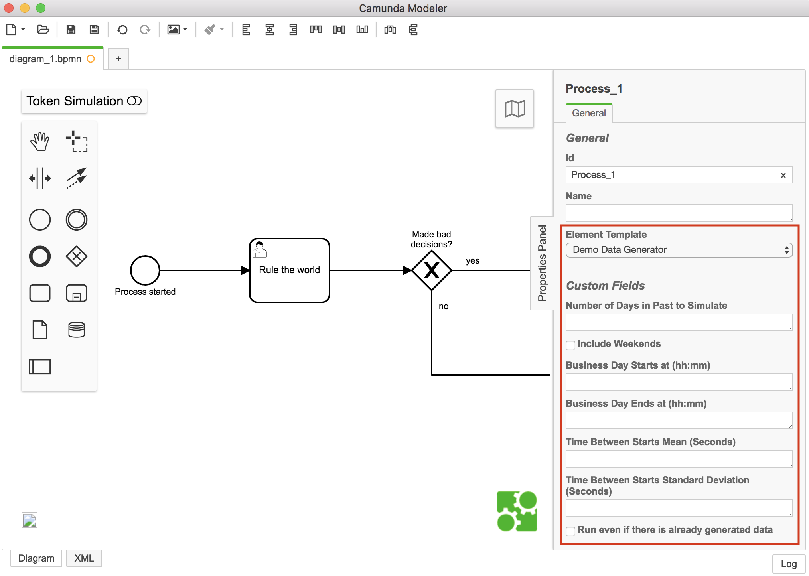
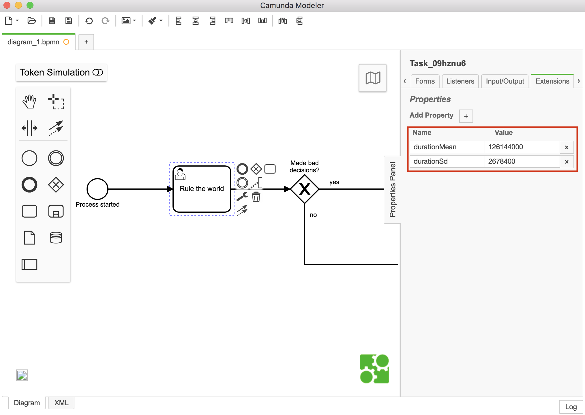
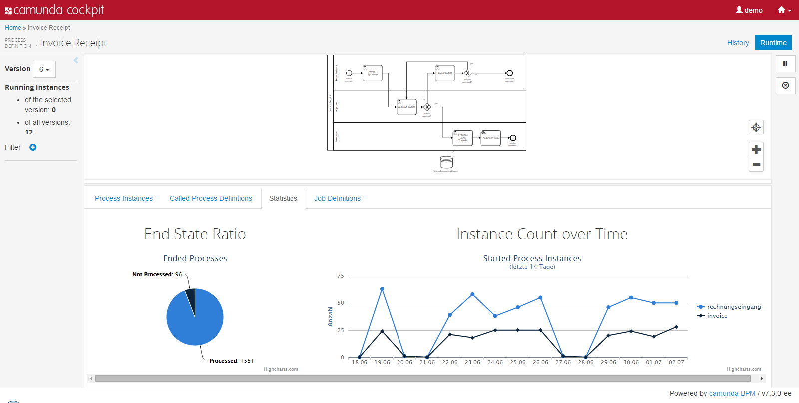

Demo Data Generator
=========================

**UNDER CONSTRUCTION!***

This project can start process instances and walk them through (skipping service tasks and other delegation code) in order to get some meaningful load in the history table - normally used to showcase reporting features.

Check the *process definition version n-1* for your generated process instances!

In order to use this you have to 

* Instrument your BPMN/CMMN
* Start the Demo Data Generator via
    * Webapplication
    * Startup Hook

Instrument your BPMN process
----------------

*Hint:* All times are expressed in *seconds*.

To make this really easy there are [Element Templates](https://docs.camunda.org/manual/latest/modeler/camunda-modeler/element-templates/) provided to maintain the attributes easily in the Camunda Modeler. See:

- [Element Templates JSON for Demo Data Generator](element-templates/demo-data-generator.json)




### Add Probabilities to all outgoing Sequence Flows on XOR-Gateways:

Extension Attribute: `probability`


### Add Distribution for Duration of User Tasks:

Extension Attributes: `durationMean` and `durationSd`



### Add Distribution for Duration of Receive Tasks / Intermediate Message Events / Boundary Message Events / External Tasks

Do it as for User Tasks - it is the same configuration.

Start the Generation
--------------------

Deploy the camunda-demo-data-generator-webapp.war. 

Now you can start the generation, you have to specify:

* process definition key to start
* How many days in the past you want to have instances
* A Distribution configuring the time between two process instance starts (mean and standard deviation)


This will deploy a new version of the process definition which is tweaked for simulation (e.g. delegation code is removed, listeners steer the decisions, ...). After the simulation the original version is deployed again as newest version.

So you will have instances in the version before the latest version if you look into cockpit:




# Add How to use it?


## Webapplication

Build the camunda-demo-data-generator-webapp.war (in subfolder camunda-demo-data-generator-webapp) using Maven. Deploy it to your container, it works on any container (Wildfly, Tomcat, JBoss, ...).

Once you deployed the application you can run it using
[localhost:8080/camunda-util-demo-data-generator/](localhost:8080/camunda-util-demo-data-generator-webapp/). You might have to adjust the port.


## Use Auto Generation

If you set up demo systems you might want to automatically generate data during startup. E.g. you could build a system were data is cleared every night and regenerated on startup. 

Add this dependency to your project (available via Maven Central):

```
  <dependency>
    <groupId>com.camunda.consulting.util</groupId>
    <artifactId>camunda-util-demo-data-generator</artifactId>
    <version>0.4.0</version>    
  </dependency>
```

Instrument your process definition XML for all processes where auto generation should be applied

```
  <process id="rechnungseingang" name="Rechnungseingang" isExecutable="true">
      <extensionElements>
        <camunda:properties>
          <camunda:property value="14" name="simulateNumberOfDaysInPast"/>
          <camunda:property value="1000" name="simulateTimeBetweenStartsBusinessDaysMean"/>
          <camunda:property value="2000" name="simulateTimeBetweenStartsBusinessDaysSd"/>
          <camunda:property value="true" name="runAlways"/>          
        </camunda:properties>
      </extensionElements>
```
If `runAlways` is omitted or other than `true`, the data generation only runs once (by checking if there already exists at least one generated process instance).

And add a @PostDeploy hook into your ProcessApplication class:
```
@ProcessApplication
public class InvoiceProcessApplication extends ServletProcessApplication {

  /**
   * In a @PostDeploy Hook you can interact with the process engine and access
   * the processes the application has deployed.
   */
  @PostDeploy
  public void startFirstProcess(ProcessEngine processEngine) {
    DemoDataGenerator.autoGenerateFor(processEngine, "rechnungseingang");
  }
```

That's it. You get automatically instances generated - if not more than 50 instances exist in history yet (to avoid new instances on every startup).

See [insurance application showcase](https://github.com/camunda-consulting/camunda-showcase-versicherungsneuantrag/) for an example of using it.

Environment Restrictions
------------------------

Built and tested against Camunda BPM version 7.6.0.


Improvements Backlog
--------------------

Quite long :-) Not yet posted here.

License
-------

[Apache License, Version 2.0](http://www.apache.org/licenses/LICENSE-2.0).
